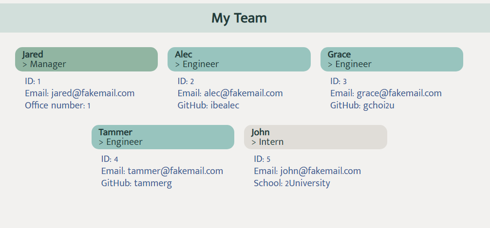

# Team Profile Generator

## Description
This program allows you to create an HTML file (along with its CSS) that shows information for your team's Manager, Engineer, and Interns.

## Installation
This program uses Inquirer v 8.2.4. To install, copy and paste the following into your command line:

```sh
npm install
```

To run the program, use the following command:

```sh
node index.js
```

## Visuals


## Tests
To view the tests for this program's js files, and after installing Jest v 29.3.1, you can copy and paste the following into your command line:

```sh
npm test
```
